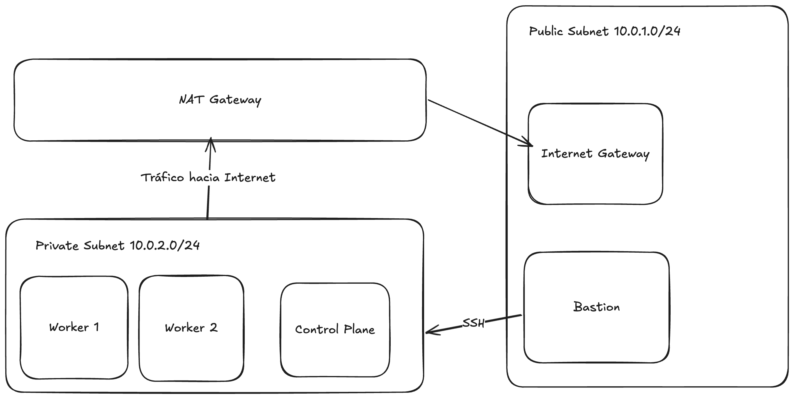

# kubernetes-lab-tfm

Deploy a kubernetes cluster based on k3s using Terraform and Ansible using standalone EC2 servers (no EKS).



# TL;DR

Apply all the infraestructure and configuration using the `run.sh` script.

```shell
./run.sh
```

## Installation 

### Create a key pair

Create a SSH key pair to connect to the EC2 instances

````shell
ssh-keygen -t ed25519
````

This file should match with *private_key_path* and *public_key_path* in `terraform.tfvars`.

### Create the cluster using terraform


````shell
cd terraform/
terraform init
# Optional: edit the remote-state.tfbackend and use S3 to store your TF state
# terraform init -backend-config remote-state.tfbackend
terraform apply
````

Now, copy your public IP for your host instance to configure `.ssh/config` file.

````
Host bastion
  HostName <PUBLIC_IP>
  User ec2-user
  IdentityFile <PRIVATE_KEY_PATH>

Host 10.0.*
  User ec2-user
  IdentityFile ~/.ssh/cluster.pem # set by the terraform code
  ProxyJump bastion
  StrictHostKeyChecking no
  UserKnownHostsFile=/dev/null
````

### Configure k3s using ansible

```shell
cd ../ansible
python3 -m venv .venv
source ./venv/bin/activate
pip install -r requirements.txt
ansible-galaxy collection install -r requirements.yaml
ansible-playbook main.yaml
```

### Usage

Connect to your bastion instance and start using the cluster

```shell
ssh bastion
kubectl get nodes
```